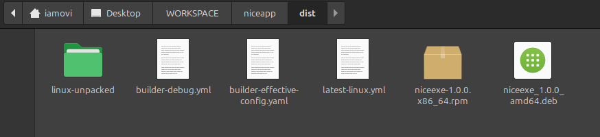
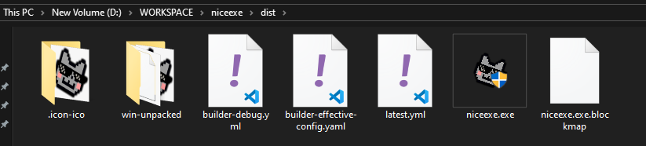
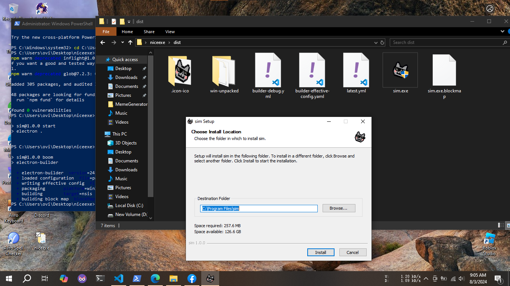

Hi,

This `niceapp` project will help you to create your Frontend Web to a Desktop App with few steps using [Electron](https://www.electronjs.org/).

**Available Platform**

- Windows .exe and .msi
- Linux .deb / .rpm and .AppImage
- macOS .dmg / .pkg

- ***Run from Windows environment to create .exe ,***

- ***Run from Linux environment to create .deb / .rpm ,***

- ***Run from macOS to create .dmg / .pkg .***

Before proceeding in linux distro, make sure you do these necessary things,

***On .rpm based distro:***

```bash
# Install alien
sudo dnf install alien           # On Fedora
sudo yum install alien           # On CentOS

# Install dpkg
sudo dnf install dpkg            # On Fedora
sudo yum install dpkg            # On CentOS
```

***On .deb based distro***

```bash
sudo apt-get update
sudo apt-get install rpm
```

And .AppImage can run in both .rpm / .deb based distro,

Here is how to run .AppImage:

```bash
chmod +x niceexe.AppImage
```

```bash
./niceexe.AppImage
```

---

Let's build App,

**Step 01**

Clone this repository:

```bash
git clone https://github.com/iamovi/niceapp.git
```
**Step 02**

Go to the cloned directory and Open terminal as Administrator.

Then run:

```bash
npm install
```

**Step 03**

Copy your Web files (html, css, js, assets, etc) and paste it to `public` folder.

And open `build` folder and Replace the default icon with your own app icon.

**Step 04**

Open `package.json` file and update as your needs.

- Customize it according to your application’s needs. Update details like name, version, description, author, and other metadata.

**Step 05**

Run,

```bash
npm run go
```
to check test your App.

When you're done doing all settings,

```bash
npm run boom
```

run this command to build your App.

- Now open `dist` dicrectory, you will see your `App` file.







***KOOL?***

---

## License 

[MIT](LICENSE)

## Author

[Maruf Ovi](https://oviportfo.netlify.app/)

Feel free to reach me if you encounter any problem,

fornet.ovi@gmail.com